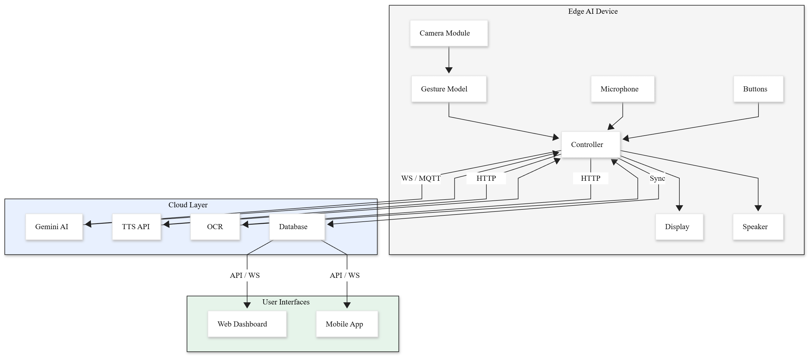

# EdgeSign — IoT-Enabled Edge–Cloud Hybrid Sign Language Translation

EdgeSign is a real-time sign language recognition system that combines edge computing on a **Raspberry Pi** with cloud-assisted processing on a **laptop**. Hand gestures are captured via camera, landmarks are extracted with **MediaPipe**, and a machine learning model classifies predefined signs into words.

## Architecture

```
Raspberry Pi (camera + MediaPipe)          Laptop (ML + Web UI)
        │                                          │
        │  WebSocket (port 8765)                   │
        └──────────────────────────────────────────┤
                                                   │
                                          Web Browser (port 3000)
```



## Project Versions

| Version | Folder | Description |
|---------|--------|-------------|
| **V1** | [`versions/v1/`](versions/v1/) | Data collection, model training, and local real-time inference |
| **V2** | [`versions/v2/`](versions/v2/) | Web interface with Pi ↔ Laptop WebSocket communication |
| **V3** | [`versions/v3/`](versions/v3/) | **Final production version** — OCR, Whisper, Gemini AI, OLED, Bluetooth |

> **Start here:** Use **V3** for the complete edge–cloud system. Use **V1** if you need to train your own model from scratch.

## Quick Start (V3 — Recommended)

### 1. Train or obtain a model

Train a model using V1, then copy `sign_language_model.pkl` into `versions/v3/models/`.

```bash
cd versions/v1
pip install -r requirements.txt
python data_collector_advanced.py   # collect sign data
python train_model.py               # train ensemble model
```

### 2. Laptop setup

```bash
cd versions/v3
pip install -r requirements_laptop.txt

# Set your Gemini API key (optional, for AI sentence generation)
set GEMINI_API_KEY=your_key_here        # Windows
export GEMINI_API_KEY=your_key_here     # Linux/Mac

python laptop_rec.py
```

Open **http://localhost:3000** in your browser.

### 3. Raspberry Pi setup

```bash
cd versions/v3
pip install -r requirements_pi.txt

# Edit pi_sender.py — set your laptop IP:
# PC_IP = "YOUR_LAPTOP_IP_OR_HOSTNAME"

python pi_sender.py              # with camera preview
python pi_sender_headless.py     # headless (SSH / no display)
```

See [`versions/v3/INSTRUCTIONS.txt`](versions/v3/INSTRUCTIONS.txt) for full setup details.

## Repository Structure

```
EdgeSign/
├── README.md                 # This file
├── .gitignore
├── docs/
│   ├── architecture/         # System diagrams
│   └── figures/              # Training result charts
└── versions/
    ├── v1/                   # ML training pipeline
    ├── v2/                   # Web interface (basic)
    └── v3/                   # Final production system
```

## Features (V3)

- Real-time hand landmark detection (MediaPipe on Pi)
- Ensemble ML gesture classification (Random Forest + XGBoost)
- Web dashboard for live detection and word collection
- EasyOCR for text extraction from camera frames
- OpenAI Whisper for audio transcription
- Google Gemini for natural sentence generation
- OLED display support on Raspberry Pi
- Bluetooth device scanning
- Text-to-speech output on laptop

## Hardware Requirements

| Component | Minimum |
|-----------|---------|
| Laptop | Python 3.10+, webcam not required |
| Raspberry Pi | Pi 3/4/5 with camera module or USB webcam |
| Network | Laptop and Pi on the same LAN |
| Optional | SH1106 OLED display, USB microphone |

## Supported Signs (Default Vocabulary)

```
hello, thanks, yes, no, go, what, time, price, you,
me, eat, now, stop, need, where, sorry, help, call
```

Add new signs in V1 by editing the `actions` list in `data_collector_advanced.py`, collecting data, and retraining.

## Documentation

- [V1 README](versions/v1/README.md) — Training and local inference
- [V2 Setup Guide](versions/v2/SETUP_GUIDE.md) — Web interface setup
- [V3 Instructions](versions/v3/INSTRUCTIONS.txt) — Full execution guide
- [V3 Upgrade Guide](versions/v3/V2_UPGRADE_GUIDE.md) — V2 → V3 improvements

## License

Academic / research project. See project documentation for citation details.
